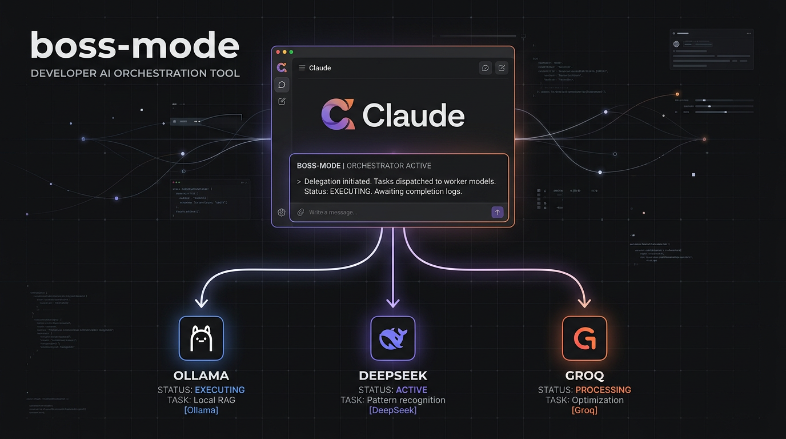

# boss-mode



> A Claude Code skill that stops Claude from spending tokens on work a cheaper model can handle.

Claude acts as the **orchestrator (boss)**: it plans, delegates, reviews, and verifies.  
Cheaper models act as **workers**: they write the code, drafts, and analysis.

---

## The Three-Tier Model

| Tier | Who | When |
|------|-----|------|
| **Boss** | Claude | Planning, architecture, file ops, final decisions, talking to you |
| **Senior worker** | DeepSeek (or similar) | Code drafts, reasoning, analysis, test generation |
| **Bulk worker** | Groq / Ollama | Translation, formatting, high-volume repetitive tasks |

The idea: Claude's tokens are expensive. Only spend them where Claude's judgment is actually needed.

---

## The Boss Loop

Every task follows this cycle:

```
1. PLAN    — Claude breaks the request into sub-tasks, picks the right worker for each
2. DELEGATE — Claude sends a structured prompt to the worker
3. REVIEW  — Claude reads the output, accepts or requests a targeted fix
4. VERIFY  — Claude runs tests/checks; if they fail, loop back to DELEGATE
```

---

## Delegation Protocol

Every delegation prompt uses this template — workers have no file access, so include all context inline:

```
CONTEXT: [project background, relevant code snippets, existing patterns]
TASK:    [exactly one deliverable — be specific]
CONSTRAINTS: [style rules, what NOT to change, existing patterns to follow]
SUCCESS: [a test command or checklist that proves the output is correct]
```

**Example — delegating a Python module to DeepSeek:**

```
CONTEXT: Python project using SQLite + akshare. Existing income.py fetches income
         statements and saves rows to a 'income_statement' table. Pattern attached below.
         [paste relevant income.py snippet]

TASK: Write balance.py that fetches balance sheet data via
      akshare.stock_balance_sheet_by_report_em(symbol), saves rows to SQLite
      table 'balance_sheet' with the same column naming convention as income.py.

CONSTRAINTS: Follow income.py exactly — same error handling, same save() pattern,
             same logging style. Do not add new dependencies.

SUCCESS: pytest tests/test_balance.py passes. Table 'balance_sheet' created with
         correct schema (verify with: sqlite3 data.db ".schema balance_sheet").
```

Claude sends this to the worker, receives the draft, writes it to disk, and runs the tests.

---

## Installation

```bash
# 1. Clone or download
git clone https://github.com/thomaslau0229/boss-mode.git

# 2. Install the skill
mkdir -p ~/.claude/skills/boss-mode
cp boss-mode/SKILL.md ~/.claude/skills/boss-mode/SKILL.md

# 3. Restart Claude Code (or open a new session)
```

Claude Code scans skill descriptions at startup. It will automatically load `boss-mode` when it detects a task that fits the trigger conditions.

---

## Configuration — Wire Up Your Workers

boss-mode expects you to have worker scripts or MCP tools Claude can call via Bash. Set these up once:

### Option A: Script-based workers

Create a simple wrapper for each model tier. Example for DeepSeek:

```python
# ~/.claude/workers/deepseek_worker.py
import sys, os, requests

prompt = sys.argv[1]
resp = requests.post(
    "https://api.deepseek.com/chat/completions",
    headers={"Authorization": f"Bearer {os.environ['DEEPSEEK_API_KEY']}"},
    json={"model": "deepseek-chat", "messages": [{"role": "user", "content": prompt}]}
)
print(resp.json()["choices"][0]["message"]["content"])
```

Then update the "Calling Workers" section in `SKILL.md` to point to your actual script paths.

### Option B: MCP tools

If you have DeepSeek or Groq set up as MCP tools in Claude Code, reference the tool name directly in `SKILL.md` instead of a Bash command. Claude will call it natively.

### Environment variables

Store your API keys in your shell profile, never in the skill file:

```bash
export DEEPSEEK_API_KEY="your-key-here"
export GROQ_API_KEY="your-key-here"
```

---

## Auto-Trigger Scenarios

Once installed, Claude applies boss-mode automatically when it sees:

- About to write >30 lines of new code → delegates draft to DeepSeek
- Executing a superpowers implementation plan → delegates each coding sub-task
- Writing test suites or test cases → delegates to DeepSeek
- Writing documentation, PR descriptions, commit messages (>200 words) → delegates draft
- Debug reasoning: analysing error logs, tracing root cause → delegates reasoning to DeepSeek
- Batch repetitive tasks (translation, formatting) → delegates to Groq/Ollama
- Pros/cons analysis or option comparison → delegates to DeepSeek, Claude makes final call

You can reinforce this by adding boss-mode to the skill table in your `CLAUDE.md`:

```markdown
| Writing code / fixing bugs  | **boss-mode** → superpowers:systematic-debugging → superpowers:verification-before-completion |
| Multi-step implementation   | **boss-mode** → superpowers:writing-plans → superpowers:executing-plans |
```

---

## Integration with Superpowers

boss-mode is designed to sit **in front of** superpowers workflows, not replace them:

| Superpowers skill | boss-mode role |
|-------------------|----------------|
| `writing-plans` | Claude writes the plan (no delegation — this needs Claude's judgment) |
| `executing-plans` | Each coding task in the plan → delegate to worker, Claude reviews |
| `brainstorming` | Claude brainstorms; deep analysis sub-tasks → delegate to DeepSeek |
| `verification-before-completion` | Always Claude — never delegated |
| `systematic-debugging` | Claude diagnoses root cause, delegates fix writing |

---

## Fix Loop

When a worker's output fails tests:

```
1. Read the exact error — don't over-diagnose
2. Write ONE targeted fix instruction
3. Delegate to the same worker
4. Re-run the test
5. Repeat up to 3 rounds
6. After 3 rounds: Claude writes the fix directly and notes why the worker struggled
```

---

## What Claude Never Delegates

- Reading or writing files
- Running shell commands or tests
- Final architecture decisions
- Responses directly to the user
- Security-sensitive logic

---

## Acknowledgements

boss-mode is built on top of patterns and frameworks from the following open-source projects:

- **[superpowers](https://github.com/obra/superpowers)** — The skill framework and workflow patterns (`writing-plans`, `executing-plans`, `verification-before-completion`, etc.) that boss-mode integrates with and extends.
- **[Andrej Karpathy's LLM coding guidelines](https://x.com/karpathy/status/2015883857489522876)** — The four principles (Think Before Coding, Simplicity First, Surgical Changes, Goal-Driven Execution) that inform how Claude delegates and verifies work. Formalised as a Claude Code skill at [andrej-karpathy-skills](https://github.com/PolarisHorizon/andrej-karpathy-skills).
- **[agentskills.io](https://agentskills.io)** — The skill specification format used by `SKILL.md`.

---

## Contributing

Issues and PRs welcome — especially new worker templates, delegation prompt examples, or integration patterns with other Claude Code skills.

## License

MIT
